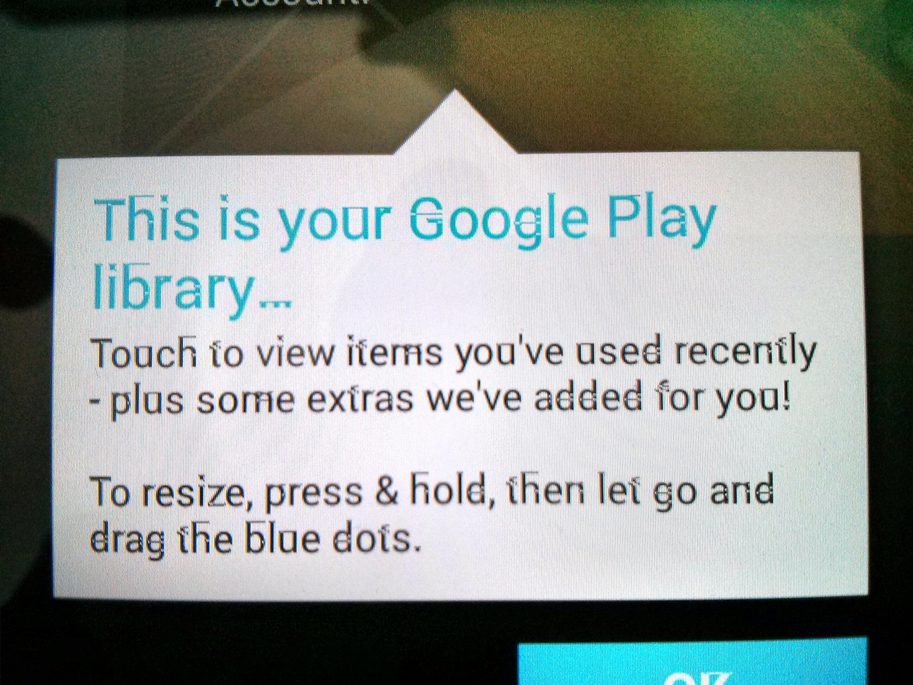

Seeing as Android 4.3 is official out I thought  I'd freshen up my Nexus 7 by flashing the official image. This wasn't a problem I had already unlocked the device. However, after several failed attempts it finally booted into the setup screen and I was greeted with beautifully glitches fonts.

The solution was to flash the image again. It's strange that the fonts would become corrupted like that, an error in the file transfer, some flash memory sector gone bad or just cosmic rays flipping bits. Who knows.