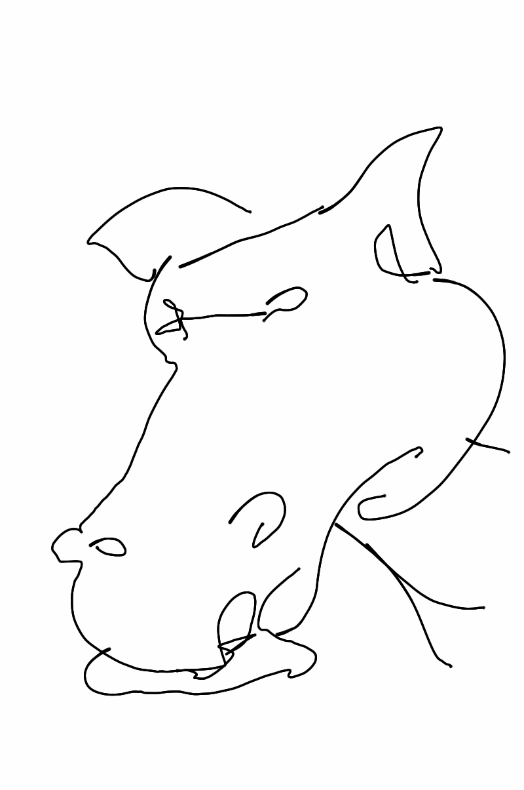

Today started out with a plan. Get into work early, test code to ensure I hadn't fucked anything up and deploy said code in readiness for go live at 9:30am. The plan went perfectly. The code went live, traffic started hitting the page and everyone was happy. That was until I received the email "I can't access the admin page". It turned out that this little interactive was a lot more popular that expected and Google didn't take kindly to that kind of traffic spike. What followed was a series of calm, with a hint of manic, conversations which resulted in a credit card sized solution.

After the dust had settled it was straight back to the larger project which is planned to launch on Tuesday. A project which I'm immensely proud to be a part of. Building upon the amazing work Robin created for FireStorm, this new project takes that same format and beautifully frames the writing and video work of some of the best creators at the Guardian. I can't wait for people to experience what we've created.

Today has been one of those days in which you look back at the last twelve hours and realise why you work where you do.

Also, drawing horses is difficult.